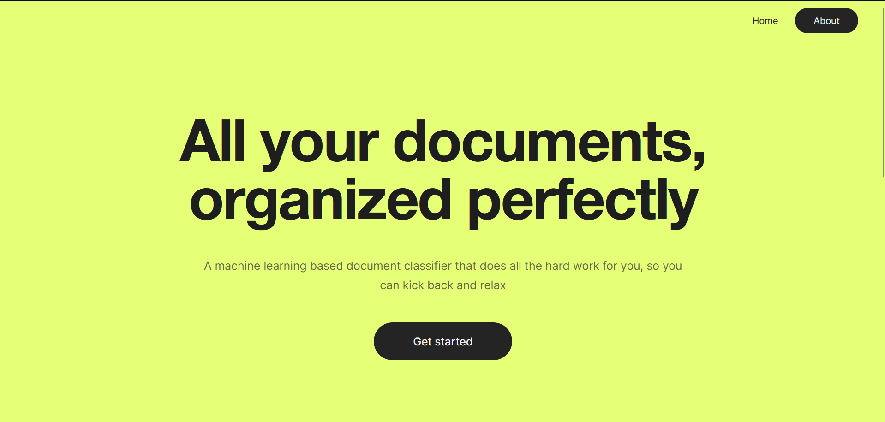
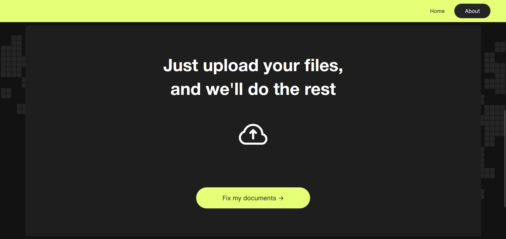

# Document Classifier

## Overview
- This repository contains a document classifier project.
- The dit-base-Business_Documents_Classified_v2 model is used to classify text documents into predefined categories.
- A webpage was designed using Figma and made with Flask to provide a easy to use inteface.

## Images

